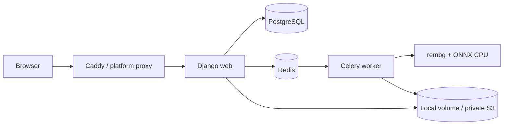

# HapusBackground

HapusBackground adalah aplikasi Django server-side untuk menghapus latar gambar memakai `rembg` dan ONNX Runtime CPU lokal. Browser mengunggah JPG/PNG/WebP, Django memvalidasi dan menyimpan job, Celery worker memprosesnya di luar request web, lalu pengguna dapat membandingkan dan mengunduh PNG transparan. Tidak ada API remove.bg atau layanan AI berbayar.

> Gambar dikirim dan diproses di server. Jangan mengklaim bahwa pemrosesan hanya terjadi di perangkat pengguna.

## Arsitektur



## Fitur

- Landing page responsif Bahasa Indonesia dengan drag-and-drop, preview, upload progress asli, dan dua mode model.
- Antrean Redis/Celery; model tidak pernah dimuat oleh proses Gunicorn.
- Status polling tanpa persentase palsu, before/after slider, download PNG, retry, dan delete.
- Riwayat khusus session browser dengan HMAC ownership; UUID saja tidak memberi akses.
- Validasi isi file menggunakan Pillow: allowlist, signature/format, verify, animasi, dimensi, pixel, ukuran, EXIF removal, dan filename/path aman.
- Custom user email-only, administrator bootstrap idempoten, dan security notice.
- Dashboard admin: KPI, tren 30 hari dengan fallback tabel/progress, job terbaru, health, filter, CSV, retry/cancel/pin/retention/delete, timeline, konfigurasi singleton, dan audit log read-only.
- Local protected storage atau private S3-compatible storage (AWS S3, R2, B2, MinIO).
- Cleanup terjadwal, stale recovery, health endpoints, JSON log, request ID, optional Sentry.
- Docker non-root, Compose, Caddy HTTPS, PostgreSQL, Redis, worker tunggal, Beat opsional.
- CI, coverage, lint, migration consistency, Docker build, dependency scan, SBOM/provenance.

## Stack dan versi utama

- Python 3.12, Django 5.2.16 LTS
- Celery 5.6.3, Redis 7.4, PostgreSQL 17
- rembg 2.0.77 + ONNX Runtime CPU, Pillow 12.2
- Gunicorn 23, WhiteNoise 6.11, psycopg 3.3
- django-storages 1.14, boto3 1.42
- Caddy 2.10, Docker/Compose
- pytest 9, pytest-django 4.12, Ruff 0.15

## Persyaratan

Untuk Docker: Docker Engine 27+ dan Compose plugin. Target utama adalah Ubuntu 24.04 x86_64, 2 vCPU, RAM sekitar 4 GB, tanpa GPU. Model `u2netp` membutuhkan download pertama kali. Worker default satu proses agar model hanya dimuat sekali.

Untuk development tanpa Docker: Python 3.12, Redis, dan PostgreSQL (SQLite hanya untuk test/development ringan).

## Quick start Docker

```bash
cp .env.example .env
# edit .env: database, Django/HMAC secrets, domain, dan bootstrap admin
docker compose -f docker-compose.yml -f docker-compose.dev.yml up --build
```

Web development tersedia di `http://localhost:8000`. Caddy dapat diaktifkan dengan profile `proxy`. Jalankan stack lengkap termasuk Beat memakai `--profile full`.

```bash
docker compose ps
docker compose logs --tail=100 web worker
docker compose exec web python manage.py doctor
```

## Development Python

```bash
python -m venv .venv
. .venv/bin/activate
pip install -r requirements-dev.txt
cp .env.example .env
python manage.py migrate
python manage.py bootstrap_admin
python manage.py runserver
celery -A config worker --concurrency=1 --prefetch-multiplier=1
```

Gunakan PostgreSQL dan Redis untuk integrasi realistis. Untuk test, `config.settings.test` memakai SQLite in-memory, in-memory storage/cache, dan eager Celery.

## Administrator bootstrap

Command berikut aman dijalankan berulang kali:

```bash
python manage.py bootstrap_admin
```

Ia membaca `BOOTSTRAP_ADMIN_ENABLED`, `BOOTSTRAP_ADMIN_EMAIL`, `BOOTSTRAP_ADMIN_PASSWORD`, `BOOTSTRAP_ADMIN_FULL_NAME`, dan `FORCE_RESET_BOOTSTRAP_ADMIN_PASSWORD`. Source, migration, image, Compose, README, dan workflow tidak berisi credential produksi. User baru dibuat staff/superuser dengan password hash Django. User existing tidak di-reset kecuali flag force bernilai `true`.

Setelah login pertama, ganti password dan selesaikan security notice. Jangan mengaktifkan force reset permanen.

## Environment

Gunakan `.env.example` sebagai daftar lengkap. Nilai penting:

| Kelompok | Variable utama |
| --- | --- |
| Django | `DJANGO_SECRET_KEY`, `ALLOWED_HOSTS`, `CSRF_TRUSTED_ORIGINS`, `ADMIN_URL_PATH` |
| Database | `DATABASE_URL`, `POSTGRES_DB`, `POSTGRES_USER`, `POSTGRES_PASSWORD` |
| Redis/Celery | `CELERY_BROKER_URL`, `CELERY_RESULT_BACKEND`, `CELERY_CONCURRENCY=1` |
| Storage | `STORAGE_BACKEND`, `MEDIA_ROOT`, `STORAGE_PREFIX`, `AWS_*` |
| Image | `DEFAULT_REMBG_MODEL`, `ALLOWED_REMBG_MODELS`, `PRELOAD_MODELS`, `MODEL_CACHE_DIR` |
| Batas | `UPLOAD_MAX_BYTES`, `MAX_IMAGE_PIXELS`, `MAX_ACTIVE_JOBS_PER_SESSION`, `MAX_QUEUE_SIZE` |
| Retensi | `JOB_RETENTION_HOURS`, `METADATA_RETENTION_DAYS`, `STALE_PROCESSING_MINUTES` |
| Privasi | `SESSION_HASH_SECRET`, `IP_HASH_SECRET` (secret berbeda dari Django) |
| Monitoring | `LOG_LEVEL`, `SENTRY_DSN`, `SENTRY_ENVIRONMENT` |

Production startup menolak environment inti yang kosong. Hard limit environment membatasi nilai yang dapat diatur melalui SiteConfiguration admin.

## Model rembg

Mode **Cepat** memakai `u2netp`; **Kualitas** memakai `isnet-general-use` bila terdaftar dalam `ALLOWED_REMBG_MODELS`. Download/preload:

```bash
PRELOAD_MODELS=u2netp python scripts/download-models.py
python manage.py benchmark_processing --input photo.jpg --runs 3 --model u2netp
```

Cache model berada pada volume `/models`. Worker memakai singleton session per model dan `max-tasks-per-child=20`. Jangan menjalankan benchmark atau download pada setiap readiness request.

## Storage

### Local

`STORAGE_BACKEND=local`, `MEDIA_ROOT=/data/media`. Web dan worker berbagi `media_data`. File tidak diproxy sebagai media publik; seluruh original/result/thumbnail dilewatkan view ownership-protected.

### S3-compatible

Set `STORAGE_BACKEND=s3`, bucket private, `AWS_ACCESS_KEY_ID`, `AWS_SECRET_ACCESS_KEY`, `AWS_STORAGE_BUCKET_NAME`, endpoint/region, `AWS_S3_SIGNATURE_VERSION=s3v4`, dan `STORAGE_PREFIX=production`. Jangan memakai ACL `public-read`. Aplikasi membuka object hanya setelah authorization; query-string expiry default 300 detik tersedia pada backend.

Gunakan bucket versioning/lifecycle sebagai perlindungan tambahan. Cleanup hanya menghapus key milik job, bukan bucket/prefix secara massal.

## Routes

- Publik: `/`, `/history/`, `/privacy/`, `/terms/`, `/faq/`
- Job: `/jobs/<uuid>/`, status, retry, delete, download, protected assets
- API v1: create/read/status/delete/download di `/api/v1/jobs/`
- Health: `/health/live/` dan `/health/ready/`
- Admin: configurable, default `/admin/`

Browser POST dilindungi CSRF. Tidak ada permissive CORS default.

## Cleanup dan operasi

```bash
python manage.py cleanup_expired_jobs --dry-run
python manage.py cleanup_expired_jobs --batch-size 100
python manage.py cleanup_expired_jobs --purge-records-older-than-days 30
python manage.py recover_stale_jobs
python manage.py storage_report
python manage.py doctor
python manage.py purge_audit_logs --older-than-days 365 --confirm
```

Pinned job tidak dibersihkan otomatis. Metadata dipertahankan sampai purge eksplisit. Command idempoten dan storage deletion aman ketika file sudah hilang.

## Deployment

### VPS Ubuntu 24.04 / Tencent Cloud

Ikuti [`deploy/vps/README.md`](deploy/vps/README.md). Ringkas:

```bash
sudo ./deploy/vps/bootstrap-server.sh
cp .env.production.example .env.production
nano .env.production
./deploy/vps/deploy.sh
```

Pastikan DNS A record mengarah ke VPS, Security Group membuka 80/443, SSH dibatasi, dan 5432/6379 tidak dibuka. Caddy memperoleh/memperbarui TLS otomatis. Mode minimal memakai cron host; mode lengkap menyalakan Beat.

### Docker Hub

Workflow `.github/workflows/docker-publish.yml` memakai `DOCKERHUB_USERNAME` dan access token `DOCKERHUB_TOKEN`. Tag: `latest` hanya main, `sha-*`, semantic version, major/minor. Lihat [`deploy/docker-hub/README.md`](deploy/docker-hub/README.md).

### Railway

Gunakan Web + Worker + managed PostgreSQL/Redis + private S3. Filesystem container tidak boleh menjadi media utama. Command Web/Worker adalah `./scripts/start.sh web|worker`. Lihat [`deploy/railway/README.md`](deploy/railway/README.md).

### Render

`render.yaml` membuat Web, Worker, cron cleanup, PostgreSQL, dan Key Value. Semua secret memakai input dashboard (`sync: false`). Media wajib S3-compatible. Lihat [`deploy/render/README.md`](deploy/render/README.md).

## Backup dan restore

`scripts/backup.sh` menghasilkan pg_dump custom, SHA-256, permission ketat, dan retention. Script VPS menjalankan dump di container PostgreSQL.

Restore aman:

1. Hentikan worker.
2. Backup database aktif.
3. Verifikasi checksum dan jalankan `pg_restore --clean --if-exists`.
4. Jalankan migration.
5. Periksa konsistensi media/storage.
6. Jalankan `doctor`.
7. Hidupkan worker.
8. Jalankan smoke test upload/download.

Media local perlu backup restic/rsync terenkripsi. S3 sebaiknya memakai versioning/lifecycle. `.env` tidak ikut backup default.

## Security

- Production: HTTPS redirect, secure cookies, HSTS, proxy SSL header, CSP, Permissions-Policy, no-sniff, frame deny, same-origin referrer.
- Upload allowlist dan revalidasi worker; filename tidak pernah dijadikan command/path storage.
- Raw IP tidak disimpan. Session/IP memakai HMAC-SHA256 secret terpisah.
- Database dan Redis hanya pada internal Docker network; container app non-root + no-new-privileges.
- Bucket S3 private; media tidak menjadi static public.
- Public error aman; internal detail dibatasi di database/log dan hanya staff berizin.
- Optional Sentry default mati dan `send_default_pii=False`.

Untuk layanan komersial, pertimbangkan 2FA admin, WAF/CAPTCHA feature flag, external log retention, malware scanning terisolasi, dan review hukum/privacy setempat.

## Testing dan quality gate

```bash
make lint
make test
python manage.py makemigrations --check --dry-run
python manage.py check
DJANGO_SETTINGS_MODULE=config.settings.production SKIP_PRODUCTION_ENV_VALIDATION=true python manage.py check --deploy
docker build -t hapusbackground:local .
```

Test mencakup accounts/bootstrap, format upload dan file palsu, session ownership, state machine, task success/failure/idempotency, download/delete, retry, cleanup/pinned/dry-run, admin/audit, headers/CSRF/hard limits, dan health failure. Target coverage aplikasi 80%.

Security workflow menjalankan `pip-audit` serta Trivy untuk HIGH/CRITICAL dan `ignore-unfixed`; alert yang belum memiliki fix dicatat tanpa membuat gate rawan feed sementara.

## Update dan rollback

VPS harus memakai tag image versioned, bukan `latest` sebagai satu-satunya referensi:

```bash
# ubah APP_IMAGE di .env.production
./deploy/vps/update.sh
```

Script membuat backup, menyimpan tag sebelumnya, pull, migration-lock, recreate, dan health check. Jika gagal, redeploy tag sebelumnya. Sebelum rollback aplikasi melewati migration, periksa kompatibilitas schema dan pulihkan backup bila migration tidak backward-compatible.

## Troubleshooting

| Masalah | Pemeriksaan / solusi |
| --- | --- |
| Model gagal download | Cek egress/DNS, permission `/models`, ruang disk, lalu jalankan `download-models.py` manual. |
| Worker offline | `docker compose logs worker`, `celery -A config inspect ping`, Redis URL, dan heartbeat. |
| Redis connection refused | Pastikan service healthy dan URL memakai hostname `redis`, bukan localhost di container. |
| Migration gagal | Periksa DATABASE_URL, lock, permission DB, backup, dan migration log. |
| Hasil tidak muncul | Periksa status/event job, worker log dengan job ID, dan akses storage bersama. |
| Volume permission denied | Pastikan UID 10001 memiliki `/data/media`, `/models`, `/tmp/app`. |
| Sertifikat Caddy gagal | Periksa A record, 80/443, Caddy email/log, dan proxy/CDN mode. |
| CSRF origin gagal | Gunakan origin lengkap dengan `https://` pada `CSRF_TRUSTED_ORIGINS`. |
| HTTP 413 | Selaraskan `UPLOAD_MAX_BYTES`, Django data limit, dan Caddy request body (default 12 MB). |
| Container OOM | Worker concurrency satu, gunakan u2netp, kurangi batas pixel, tambah RAM; swap hanya penyangga. |
| Railway/Render media hilang | Gunakan S3; filesystem ephemeral bukan storage media. |
| S3 signature mismatch | Periksa endpoint, region, addressing style, clock, dan signature v4. |
| Admin belum dibuat | Periksa bootstrap env, jalankan `bootstrap_admin`; password tidak dicetak ke log. |
| Static admin rusak | Jalankan `collectstatic`, cek WhiteNoise manifest dan volume/source image. |

## Lisensi

Kode aplikasi: MIT. Lihat `LICENSE` dan `THIRD_PARTY_NOTICES.md`. Lisensi/terms model AI tetap harus ditinjau operator.
